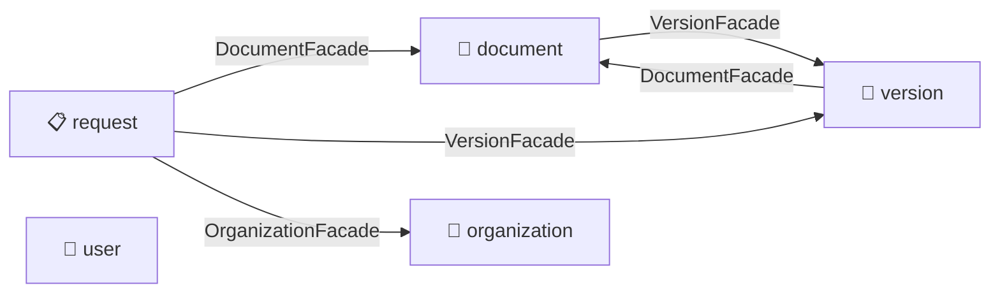
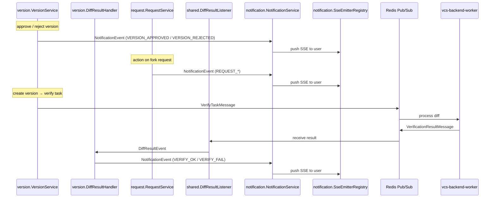
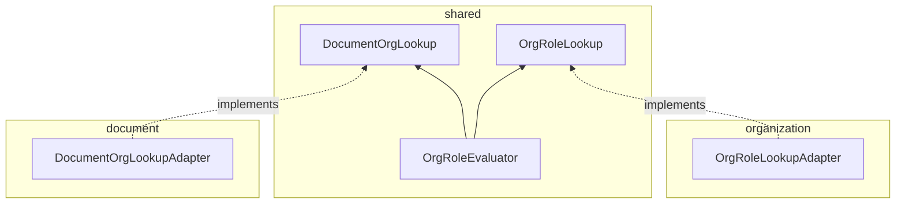

# Module Dependency Map

Visual overview of all Spring Modulith modules, their cross-references, and communication patterns.

> **Mermaid version:** Diagrams target Mermaid **v11+** syntax
> ([flowchart docs](https://mermaid.js.org/syntax/flowchart.html),
> [sequence docs](https://mermaid.js.org/syntax/sequenceDiagram.html)).
> `flowchart` is used instead of the legacy `graph` keyword.

## Legend

| Syntax | Renders as | Meaning |
|---|---|---|
| `-->` | solid arrow | Compile-time dependency (facade / service / utility import) |
| `-.->` | dotted arrow | Event-driven (`ApplicationEvent` — no compile dep on listener) |
| `-.-` | dotted line (no arrow) | Dependency inversion (shared defines interface ← module implements) |
| `<-->` | bidirectional arrow | Two-way channel (Redis Pub/Sub) |
| `==>` | thick arrow | Inheritance (`extends BaseEntity`) |

---

## Full Dependency Graph

```mermaid
%% Uses 'flowchart' (not legacy 'graph') for bidirectional arrows and subgraph direction.
%% Link types:  -->  solid (compile-time)
%%              -.-> dotted arrow (event-driven)
%%              -.-  dotted line  (dependency inversion / implements)
%%              ==>  thick arrow  (BaseEntity inheritance)
%%              <--> bidirectional (Redis Pub/Sub)

flowchart TB
    subgraph shared ["🔧 shared"]
        direction TB
        S_SEC["security<br/><small>OrgRoleEvaluator · JwtPrincipal · SecurityHelper</small>"]
        S_INV["security interfaces<br/><small>DocumentOrgLookup · OrgRoleLookup</small>"]
        S_S3["s3<br/><small>S3PresignService</small>"]
        S_REDIS["redis<br/><small>DiffTaskPublisher · DiffResultListener · DiffResultEvent</small>"]
        S_MAP["mapper<br/><small>MapStructConfig · JsonNullableMapper</small>"]
        S_EXC["exception<br/><small>AppException · GlobalExceptionHandler</small>"]
        S_WEB["web<br/><small>PageMapper · AuthController</small>"]
        S_DOM["domain<br/><small>BaseEntity</small>"]
        S_CFG["config<br/><small>SecurityConfig · RedisConfig · S3Properties · KeycloakProperties</small>"]
    end

    subgraph document ["📄 document"]
        D_SVC["DocumentService"]
        D_WEB["DocumentsController<br/>MetadataController"]
        D_FAC["DocumentFacade"]
        D_ADP["DocumentOrgLookupAdapter"]
    end

    subgraph version ["🔢 version"]
        V_SVC["VersionService"]
        V_WEB["VersionsController"]
        V_FAC["VersionFacade"]
        V_DRH["DiffResultHandler"]
    end

    subgraph organization ["🏢 organization"]
        O_SVC["OrganizationService"]
        O_WEB["OrganizationsController"]
        O_FAC["OrganizationFacade"]
        O_ADP["OrgRoleLookupAdapter"]
    end

    subgraph request ["📋 request"]
        R_SVC["RequestService"]
        R_WEB["RequestsController"]
        R_FAC["RequestFacade"]
    end

    subgraph notification ["🔔 notification"]
        N_SVC["NotificationService"]
        N_WEB["NotificationController"]
        N_SSE["SseEmitterRegistry"]
        N_EVT["NotificationEvent"]
    end

    subgraph user ["👤 user"]
        U_SVC["UserService"]
        U_WEB["UserController"]
        U_FAC["UserFacade"]
    end

    subgraph external ["☁️ External Systems"]
        KC["Keycloak<br/><small>JWT issuer</small>"]
        PG["PostgreSQL<br/><small>vcs_core schema</small>"]
        MINIO["MinIO / S3<br/><small>file storage</small>"]
        REDIS_EXT["Redis<br/><small>Pub/Sub</small>"]
        WORKER["vcs-backend-worker<br/><small>diff engine</small>"]
    end

    %% ── BaseEntity inheritance (thick arrow ==> ) ──
    S_DOM ==>|extends| D_SVC
    S_DOM ==>|extends| V_SVC
    S_DOM ==>|extends| O_SVC
    S_DOM ==>|extends| R_SVC
    S_DOM ==>|extends| N_SVC
    S_DOM ==>|extends| U_SVC

    %% ── Dependency inversion: dotted line, no arrow (-.-) ──
    %% shared defines interface; feature module implements it
    D_ADP -.-|implements| S_INV
    O_ADP -.-|implements| S_INV
    S_SEC --> S_INV

    %% ── document compile-time deps (-->) ──
    D_SVC --> S_S3
    D_SVC --> S_EXC
    D_SVC --> V_FAC
    D_SVC --> S_MAP
    D_WEB --> S_SEC
    D_WEB --> S_WEB

    %% ── version compile-time deps (-->) ──
    V_SVC --> D_FAC
    V_SVC --> S_S3
    V_SVC --> S_REDIS
    V_SVC --> S_EXC
    V_SVC --> S_INV
    V_SVC --> S_MAP
    V_WEB --> S_SEC
    V_WEB --> S_WEB
    V_DRH --> D_FAC
    V_DRH --> S_REDIS

    %% ── organization compile-time deps (-->) ──
    O_SVC --> S_EXC
    O_SVC --> S_MAP
    O_WEB --> S_SEC

    %% ── request compile-time deps (-->) ──
    R_SVC --> D_FAC
    R_SVC --> V_FAC
    R_SVC --> O_FAC
    R_SVC --> S_EXC
    R_SVC --> S_MAP
    R_WEB --> S_SEC

    %% ── user compile-time deps (-->) ──
    U_SVC --> S_EXC
    U_SVC --> S_SEC
    U_SVC --> S_MAP
    U_WEB --> S_SEC

    %% ── notification compile-time deps (-->) ──
    N_SVC --> S_EXC
    N_WEB --> S_SEC

    %% ── Event-driven: dotted arrow (-.->), no compile dep on listener ──
    V_SVC -.->|NotificationEvent| N_SVC
    V_DRH -.->|NotificationEvent| N_SVC
    R_SVC -.->|NotificationEvent| N_SVC
    S_REDIS -.->|DiffResultEvent| V_DRH

    %% ── External system connections ──
    S_CFG --> KC
    S_S3 --> MINIO
    S_REDIS <-->|Pub/Sub| REDIS_EXT
    REDIS_EXT <-->|Pub/Sub| WORKER

    %% ── All entities persist to PostgreSQL ──
    D_SVC --> PG
    V_SVC --> PG
    O_SVC --> PG
    R_SVC --> PG
    N_SVC --> PG
    U_SVC --> PG
```

---

## Cross-Module Facade Access

Shows which modules call which facades (the **only** legal way to access another module's data):

---

## Event Flow

All inter-module events are Spring `ApplicationEvent`s — no direct imports of the listener module:

---

## Dependency Inversion Pattern

`shared` cannot import feature modules, so it defines interfaces that feature modules implement:

---

## Module → Shared Sub-Package Usage Matrix

| Module | BaseEntity | AppException | S3Presign | Redis | SecurityHelper | MapStructConfig | PageMapper |
|---|:---:|:---:|:---:|:---:|:---:|:---:|:---:|
| **document** | ✅ | ✅ | ✅ | — | ✅ | ✅ | ✅ |
| **version** | ✅ | ✅ | ✅ | ✅ | ✅ | ✅ | ✅ |
| **organization** | ✅ | ✅ | — | — | ✅ | ✅ | — |
| **request** | ✅ | ✅ | — | — | ✅ | ✅ | — |
| **notification** | ✅ | ✅ | — | — | ✅ | — | — |
| **user** | ✅ | ✅ | — | — | ✅ | ✅ | — |

